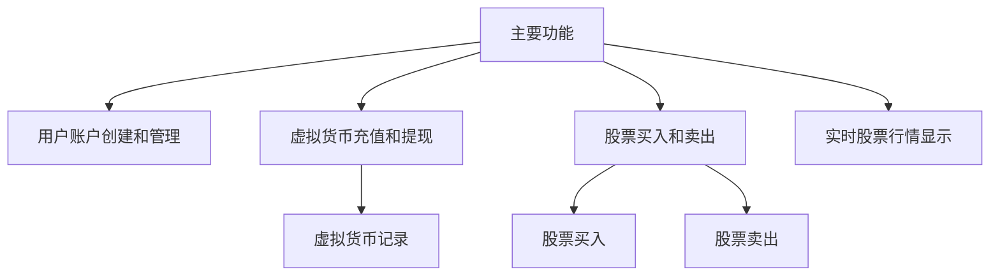
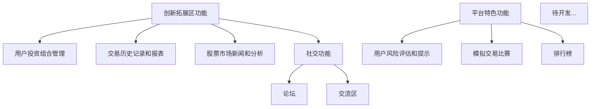

## 基于C++和Qt开发平台的股票交易管理系统
#### 具体需求 ####
- 创建一个模拟股票交易的平台，允许用户使用虚拟货币进行股票交易。
- 平台应提供实时股票数据更新、交易、资产管理等功能。

##### 技术面基本要点 #####
- Qt界面开发
- 文件I/O操作
- 多线程处理
- GDI图形处理
- sqlite数据库存储
- 网络编程

##### 系统主要功能 #####
- 主要功能 
    - 用户账户创建和管理功能。
    - 虚拟货币充值和提现功能。
    - 股票买入和卖出功能。
    - 实时股票行情显示功能。
- 创新拓展区功能
    - 用户投资组合管理功能。
    - 交易历史记录和报表功能。
    - 股票市场新闻和分析功能。
    - 社交功能，如论坛和交流区。
- 平台特色功能
    -  用户风险评估和提示功能。
    - 模拟交易比赛和排行榜功能。
- 待开发...

##### 源代码储存平台 #####
GitHub [GitHub平台访问,可查看我们的源代码](https://github.com) 
##### 部分技术学习来源 #####
GitHub [开源网站GitHub](https://github.com) 
CSDN   [中文技术交流网站](https://github.net) 
BiliBili [视频学习网站](https://bilibili.com) 
#### 软件开发名单 ####

WHU计算机学院"我们做的都队"
| 姓名 | 职务 | 联系方式 |GitHub账户|
| :----:| :----:| :----:| :----:  |
|黄义健|项目经理|15363666345|303327065@qq.com|
|张馨仪|研发人员|13660552309|2662810357@qq.com|
| 甘鼎井| 研发人员|13986073616|gandingjing2004@outlook.com|
|汪裕航|产品经理|18921095220|3257669069@qq.com|
| 侯宜辰| 开发经理| 18191039403| 975292748@qq.com|
#### 系统功能图一览 ####

### 未完待续 Updating...
