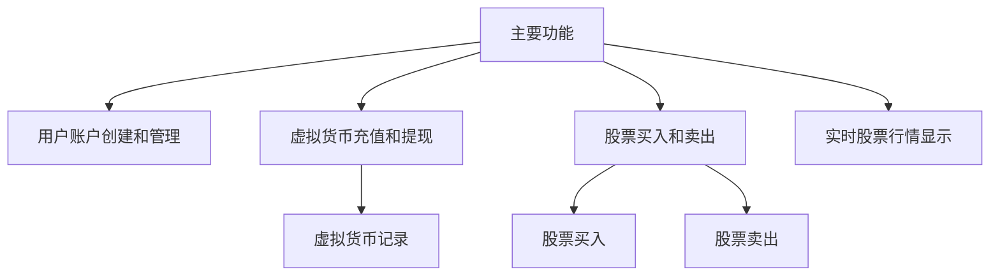
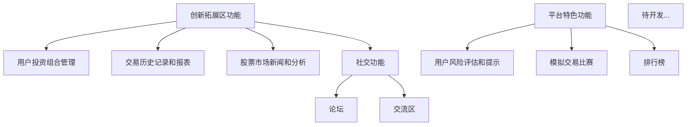

## 基于C++和Qt开发平台的股票交易管理系统
#### 具体需求 ####
- 创建一个模拟股票交易的平台，允许用户使用虚拟货币进行股票交易。
- 平台应提供实时股票数据更新、交易、资产管理等功能。

##### 技术面基本要点 #####
- Qt界面开发
- 文件I/O操作
- 多线程处理
- GDI图形处理
- sqlite数据库存储
- 网络编程

##### 系统主要功能 #####
- 主要功能 
    - 用户账户创建和管理功能。
    - 虚拟货币充值和提现功能。
    - 股票买入和卖出功能。
    - 实时股票行情显示功能。
- 创新拓展区功能
    - 用户投资组合管理功能。
    - 交易历史记录和报表功能。
    - 股票市场新闻和分析功能。
    - 社交功能，如论坛和交流区。
- 平台特色功能
    -  用户风险评估和提示功能。
    - 模拟交易比赛和排行榜功能。
- 待开发...

##### 源代码储存平台 #####
GitHub [GitHub平台访问,可查看我们的源代码](https://github.com) 
##### 部分技术学习来源 #####
GitHub [开源网站GitHub](https://github.com) 
CSDN   [中文技术交流网站](https://github.net) 
BiliBili [视频学习网站](https://bilibili.com) 
#### 软件开发名单 ####

WHU计算机学院"我们做的都队"
| 姓名 | 职务 | 联系方式 |GitHub账户|
| :----:| :----:| :----:| :----:  |
|黄义健|项目经理|15363666345|303327065@qq.com|
|张馨仪|研发人员|13660552309|2662810357@qq.com|
| 甘鼎井| 研发人员|1398607361|gandingjing2004@outlook.com|
|汪裕航|产品经理|18921095220|3257669069@qq.com|
| 侯宜辰| 开发经理| 18191039403| 975292748@qq.com|
#### 系统功能图一览 ####

## 功能详解 ##
###  用户账户创建和管理功能 ###
- 用户账户创建

   - 作为新用户，进入系统注册页面。
   - 输入必要的个人信息，如用户名、电子邮件和密码。
   - 确认输入信息无误后，点击注册按钮完成注册。
   -预期结果：系统显示注册成功，并自动登录到用户账户。

- 用户账户管理

   - 作为注册用户，登录到系统的个人账户页面。
   - 在个人账户页面中找到“账户管理”选项。
   - 点击“修改个人信息”，可以编辑和更新个人资料，如联系方式和密码。

### 虚拟货币充值功能 ###
- 虚拟货币充值  
作为已登录用户，进入“充值”页面。
选择充值金额，并选择支付方式（使用虚拟货币实现）。
预期结果：系统显示充值成功，并更新账户余额。

### 股票买入和卖出功能 ###
- 股票买入

作为注册用户，登录到系统的股票交易页面。
搜索或选择要购买的股票，输入购买数量和价格。
确认交易订单并提交。
##### 预期结果：系统显示买入订单已成功提交，并更新用户的股票持仓。 #####

- 股票卖出

作为注册用户，登录到系统的股票交易页面。
查找已持有的股票，输入卖出数量和价格。
确认交易订单并提交。
##### 预期结果：系统显示卖出订单已成功提交，并更新用户的股票持仓和账户余额 #####

### 实时股票行情显示功能 ###
- 实时股票行情显示

作为登录用户，进入系统的股票行情页面。
实时显示各支股票的最新价格和涨跌幅。
可以根据需要刷新页面或选择特定股票进行详细查看。
  - 预期结果：系统实时更新股票行情数据，并保持页面信息的准确性。

### 用户投资组合管理功能 ###
- 投资组合创建与编辑

作为登录用户，进入“投资组合”管理页面。
点击“创建新组合”或选择现有组合进行编辑。
添加或删除股票、设置权重和目标收益等信息。
预期结果：系统显示投资组合已成功创建或更新，并反映在用户的投资组合列表中。

### 交易历史记录和报表功能 ###
- 交易历史记录

作为登录用户，进入“交易历史”页面。
显示用户的历史交易记录，包括买入、卖出时间、股票名称、价格等详细信息。
预期结果：系统显示完整的交易历史记录，并支持按时间范围和交易类型进行筛选。

### 股票市场新闻和分析功能 ###
- 股票市场新闻

作为登录用户，进入“市场新闻”页面。
显示最新的股票市场动态、重要新闻和分析评论。
预期结果：系统显示及时更新的市场新闻和分析内容，帮助用户了解市场趋势。

### 用户风险评估和提示功能 ###
- 风险评估

作为登录用户，进入“风险评估”页面。
完成风险测评问卷，系统根据答案评估用户的风险承受能力。
预期结果：系统根据用户答案生成风险评估报告，并向用户提供个性化的投资建议和风险提示。

### 社交功能，如论坛和交流区 ###

作为登录用户，进入系统的论坛或交流区。
参与讨论话题、发表观点或回复他人的帖子。
预期结果：系统显示用户发表的帖子或评论，并支持用户与其他用户的交流互动。

### 模拟交易比赛和排行榜功能 ###
- 模拟交易比赛参与

作为登录用户，进入系统的模拟交易比赛页面。
注册参加正在进行的比赛或创建新的模拟交易组。
预期结果：系统显示比赛排行榜和个人成绩，更新参赛者的交易表现并实时排名。

#### 功能图示 ####

### 未完待续 Updating...
